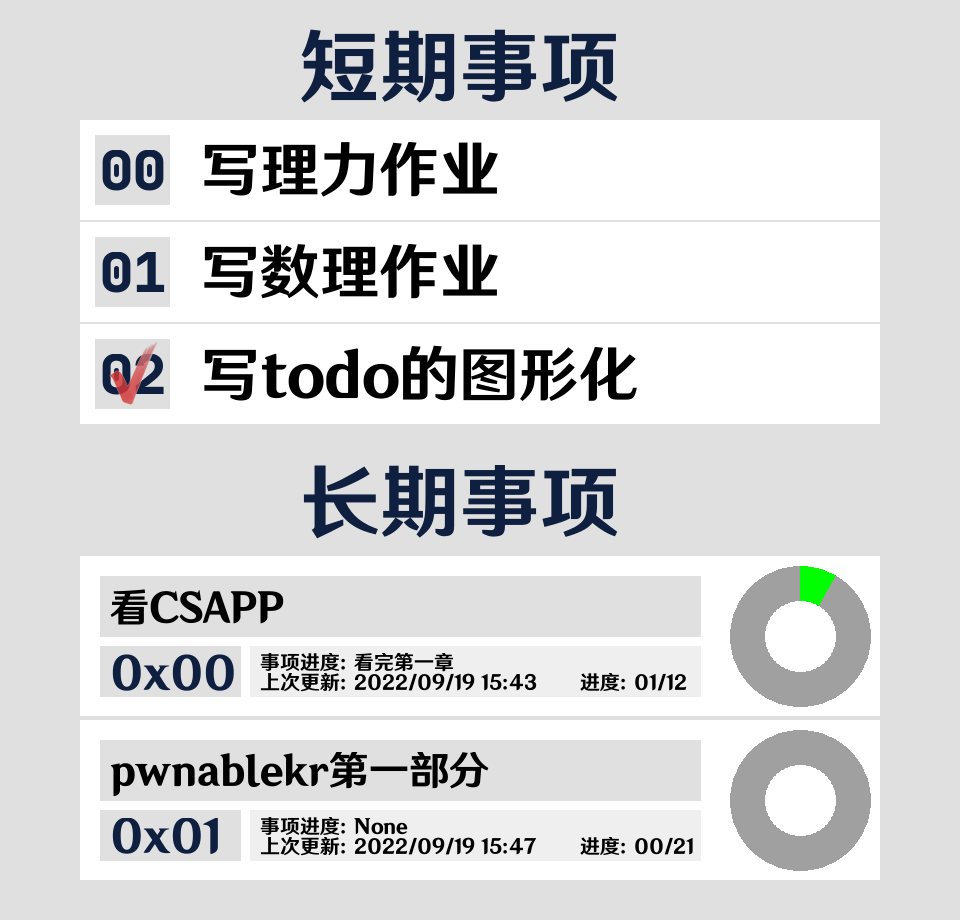

# 糖糖bot

简单来说就是华华看大家都有自己的qq机器人，也写了一个。

功能列表
* test 检查糖糖存活状态
* answer 用答案之书回答问题
* coin 赛博抛硬币
* poke 糖糖的三连戳反馈
* peep 拆闪照
* eavesdrop 偷听上一条撤回的消息
* signin/lottery 与另一位bot的互动，自动赚钱
* todo 华华的赛博todolist
* set 作为管理员设置各项功能开关等
* help 查看帮助

至于各项功能基本在**help**指令里很明确了，下面暂时只放一个ToDo的详细用法

## ToDo插件
### 写在前面
此功能讲事项简单的分为两种，短期事项和长期推进事项。
>其中短期事项认为是可以在较短时间内完成并且打上勾的，如某节课的某项作业；
而长期事项则是分为许多部分，需要时间一部分一部分完成，如看完一本书、某部番。

写此功能的目的在于提醒自己有哪些短期事项需要完成，同时也有长期事项的进度可视化，提醒自己要持续的推进每项长期事项。
## 添加事项
由于通过对话和用户交互实在是太痛苦了，而且设计之初只有华华自己要用这个todo，于是采用了偷懒的传入json让糖糖解析的方式，丑陋，但是方便。
```
-todo add {'type':'short', 'name':'事项的名字'}
-todo add {'type':'long', 'name':'事项的名字', 'parts':(int)事件的部分数量}
```
其中对于长期任务还可选两项
```
{'part':(int)进展到的部分的编号, 'pname':'目前进展的描述'}
```
## 事项排序
所有的事项会由糖糖自己排序，其中对于短期事项规则如下：
```
未完成 < 已完成
事项名短 < 事项名长
```
对于长期事项，以 "已完成部分/未完成部分" 作为键值降序排序，即快要完成、进度最多的排在最前面。
## 完成事项/推进事项
对于短期事项
```
-todo done id
```
对于长期事项要麻烦一点
```
-todo done {'id':'0x??', 'part': (int)进行到的编号, 'pname':'对进度的描述'}
```
## 删除事项
这个比较统一，用十进制id和十六进制id对于长短事项进行区分
```
-todo del id
如：
-todo del 5
-todo del 0x03
```
## 展示
